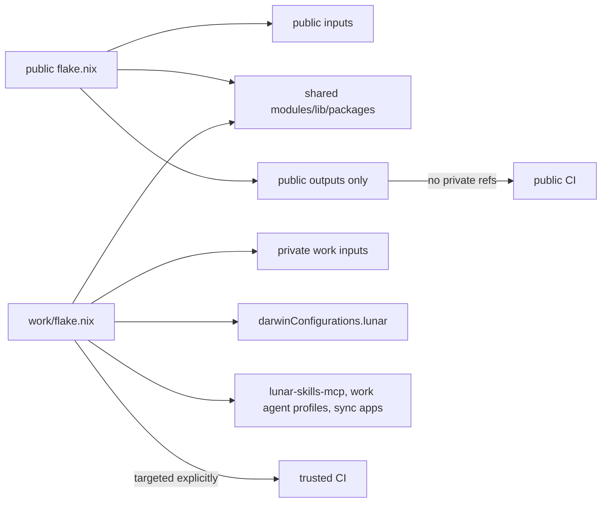
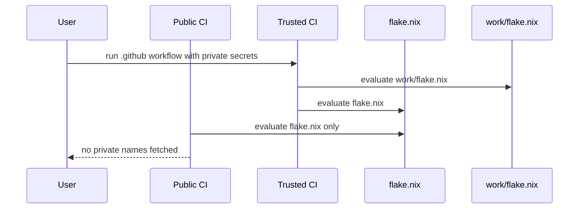

# Summary

This proposal makes the repository safe for public CI by moving private work-only flakes, inputs, and generated agents commands into a nested `work/` flake, while preserving a single source of truth for `lib/`, `modules/`, `packages/`, `agents/`, and `hosts/darwin/work/`.

## Context and problem

- The current root flake declares work-only dependencies (`lunar-tools`, `backend-engineering-practices`) and drives `darwinConfigurations.lunar`, `sync-work-skills`, and `lunar-skills-mcp` directly from public `flake.nix` and `flake/hosts/darwin/lunar.nix`.[^source-flake-nix][^source-flake-host][^source-flake-packages][^source-flake-apps]
- The host module at `flake/hosts/darwin/lunar.nix` currently injects both `lunar-tools` and `nix-agents` and is imported as part of the default darwin host set in root outputs.[^source-flake-host]
- `modules/home/programs/devops.nix` currently reads `inputs.lunar-tools` directly to build kubeconfig merge behavior, creating an unconditional private dependency edge from the module contract.[^source-devops-module]
- `lunar-skills-mcp` currently requires `backendEngineeringPractices` input at package call time and is discovered through generic package scanning.[^source-lunar-skills][^source-flake-packages]
- Agent base settings and the Lunar MCP definition also resolve `self.packages.${system}.lunar-skills-mcp`; root profile generation must therefore be split into public-only and work-aware paths rather than merely excluding the package output.[^source-agent-settings][^source-lunar-mcp]
- CI and forks currently evaluate a single combined graph, which means every actor touching the repository must resolve all private inputs declared at top level.[^source-flake-nix]

## Goals and non-goals

### Goals
- Make `flake.nix`/`flake.lock` public-safe by removing private transitive inputs and work outputs.
- Introduce `flake/inputs.nix` to centralize public inputs.
- Add a nested `work/` flake that owns:
  - `lunar-tools`
  - `backend-engineering-practices`
  - private transitives required by those repos
  - `darwinConfigurations.lunar`
  - `lunar-skills-mcp`
  - `sync-work-skills`
  - work-aware `sync-agents`.
- Move/adapt host file `flake/hosts/darwin/lunar.nix` to `work/hosts/lunar.nix` and keep `hosts/darwin/work/` source directory shared.
- Refactor `modules/home/programs/devops.nix` to accept injected kubeconfig/package metadata from host/modules, not a private input lookup.
- Parameterize package and app discovery to exclude work outputs by default in public flake code paths.

### Non-goals
- Not migrating shared modules into private repos.
- Not changing package internals of `lunar-skills-mcp` beyond input wiring.
- Not altering existing agent presets and prompt files unrelated to flake/app/module boundaries.
- Not changing macOS or NixOS module semantics beyond explicit work/private isolation boundaries.

## Proposed repository tree

```text
.
├── flake.nix
├── flake.lock
├── flake/
│   ├── inputs.nix             # public inputs only
│   ├── apps.nix               # app discovery + public app constructor
│   ├── packages.nix           # package discovery with allow/deny filter
│   ├── hosts/
│   │   └── darwin/            # shared host helper modules
│   ├── checks.nix
│   └── deploy.nix
├── lib/
├── modules/
├── packages/
├── agents/
├── hosts/
│   └── darwin/
│       └── work/              # shared work host composition, reusable by both flakes
└── work/
    ├── flake.nix
    ├── flake.lock
    ├── flake/
    │   └── inputs.nix         # work-only + shared public inputs
    ├── hosts/
    │   └── lunar.nix          # moved from flake/hosts/darwin/lunar.nix
    ├── packages/
    ├── apps/
    │   └── ???                # optional work-local helpers
    └── modules/               # optional work-only overrides
```

## Design principles

- **Two-flake topology:** Public flake must remain evaluable in anonymous forks without access to private registries/SSH keys.
- **Single-source shared assets:** `lib/`, `hosts/darwin/work/`, `modules/`, `packages/`, and `agents/` are imported by both flakes as needed.
- **Input visibility contract:** only public URLs and branches must be in root `flake.lock`; private URLs and names may appear only in `work/flake.lock`.
- **Command partitioning:** public commands must never require evaluation of `work` outputs.



The root flake MUST NOT declare the work flake as an input. Declaring it would put its private transitive graph back into the root lock and defeat the isolation boundary.

## Why mkIf / optionalAttrs / follows / env-conditionals cannot hide declared inputs

```text
Evaluation stages:
1) input resolution from `inputs + flake.lock`
2) dependency fetch for required refs/revs
3) recursive evaluation of selected outputs
```

- `mkIf` and `optionalAttrs` run in stage 3 and cannot prevent stage 1/2 from seeing declared inputs.
- `follows` modifies input inheritance but does not defer source resolution; it may alter transitive sources, not hide dependency declarations.
- environment-conditionals only alter branch/runtime behavior, yet private refs are still declared and therefore part of graph metadata and lock metadata.
- therefore security expectation must be enforced by graph partitioning, not by conditional expression tricks.

## Public inputs extraction (`flake/inputs.nix`)

```nix
# Representative snippet (not drop-in)
{
  nixpkgs.url = "github:nixos/nixpkgs/nixpkgs-unstable";
  nixpkgs-unstable.follows = "nixpkgs";

  darwin.url = "github:nix-darwin/nix-darwin/master";
  darwin.inputs.nixpkgs.follows = "nixpkgs";

  home-manager.url = "github:nix-community/home-manager/master";
  home-manager.inputs.nixpkgs.follows = "nixpkgs";

  # ... public and stable-only inputs
  # no lunar-tools/backend-engineering-practices here
}
```

## Root flake adaptation

### Representative snippet for `flake.nix`

```nix
# Representative shape, not a drop-in replacement for current output composition.
{
  inputs = import ./flake/inputs.nix; # public declarations only

  outputs = inputs@{ self, nixpkgs, ... }:
    let
      publicPackagePolicy.excludedPackages = [ "lunar-skills-mcp" ];
      publicAppPolicy.includeWorkApps = false;
      publicAgentPolicy.includeWorkProfiles = false;
    in {
      # Existing output builders are adapted to consume the policies above.
      # No work flake input, Lunar host, private package, or work profile is
      # declared or exported from this root.
    };
}
```

The exact current builder arities should be preserved while adding explicit policy parameters; this snippet expresses the boundary rather than claiming a ready-to-apply function signature. Trusted automation targets the nested flake directly instead of reaching it through root outputs.

## Work flake ownership and contract

### `work/flake.nix` responsibilities

- Own all private work dependencies and applications tied to work context.
- Export:
  - `darwinConfigurations.lunar`
  - `packages.${system}.lunar-skills-mcp`
  - `apps.${system}.sync-work-skills`
  - `apps.${system}.sync-agents` (work-aware behavior, e.g., path injection from private package metadata)

### Work host migration

Current host config at `flake/hosts/darwin/lunar.nix` is moved to `work/hosts/lunar.nix`.

```nix
# Representative snippet (not drop-in)
{
  lunar-tools,
  nix-agents,
  ...
}:
{
  system = "aarch64-darwin";
  user = "kisw";
  hostModule = ../../hosts/darwin/work;
  homeModule = ../../hosts/darwin/work/home.nix;
  nixDirectory = "/Users/.../nix-config";

  overlays = [
    lunar-tools.overlays.default
    nix-agents.overlays.default
  ];

  # work-specific git / ssh / feature flags
}
```

### Host and package path mapping



## Refactor `modules/home/programs/devops.nix`

Current coupling reads `inputs.lunar-tools` directly.[^source-devops-module]

```nix
# Proposed option additions; retain the module's existing `enable` option and
# kubeconfig merge implementation.
options.homeModules.devops = {
  extraKubeconfigPaths = lib.mkOption {
    type = lib.types.listOf lib.types.str;
    default = [ ];
    description = "Additional read-only kubeconfig sources.";
  };

  extraPackages = lib.mkOption {
    type = lib.types.listOf lib.types.package;
    default = [ ];
    description = "Additional packages supplied by the host composition.";
  };
};
```

The implementation must preserve the current writable kubeconfig, homelab source, modification-time guard, file permissions, and flattening behavior. If the merge implementation is changed, it must write to a temporary file and atomically rename it; it must never redirect output onto a file that is simultaneously present in `KUBECONFIG`.

### Host module injection from work flake

```nix
# Representative work-host configuration.
homeModules.devops.extraKubeconfigPaths = [
  "${inputs.lunar-tools.packages.${system}.lunar-zsh-plugin}/.kube/config"
];

homeModules.devops.extraPackages = [
  inputs.lunar-tools.packages.${system}.lunar-kubehelper
];
```

This removes direct private-input coupling from the shared module and limits it to work-host composition.

## Parameterized package and app discovery

### `flake/packages.nix`

Add an `excludedPackages ? [ ]` parameter to the existing constructor and filter names before `callPackage`. The public root passes `[ "lunar-skills-mcp" ]`; the work flake passes `[ ]`. Preserve the constructor's existing return shape (`packages` and `packageNames`) and its current per-system call pattern.

```nix
# Policy fragment inside the existing constructor.
selectedNames = builtins.filter
  (name: !(builtins.elem name excludedPackages))
  discoveredNames;
```

### `flake/apps.nix`

Keep public app construction independent of work inputs. The public root constructs only generic apps. The work flake imports the same generic app builder, then merges work-only apps built by a separate work-local adapter that has explicit access to the private inputs.

```nix
# Representative composition in work/flake.nix.
apps.${system} =
  publicAppsFor system
  // workAppsFor {
    inherit system;
    inherit (inputs) backend-engineering-practices lunar-tools;
  };
```

This avoids undefined conditional app constructors in the public builder and makes the private dependency boundary explicit.

### Ownership and inclusion policy

| Artifact set | Owner | Included by root flake | Included by work flake |
| --- | --- | --- | --- |
| Work package (`lunar-skills-mcp`) | Work team | excluded | included |
| Shared utility packages | platform team | included | included |
| Work MCP/profile wiring (`agents/base-settings.nix`, `agents/defs/mcps/lunar-skills.nix`) | Work team | omitted or parameterized without a package | included with injected package |
| Sync helper apps (`sync-agents`, `sync-work-skills`) | Work team | public-profile variant only, or excluded | work-aware variants included |
| Validation/test packages | repo team | included | included |

## Proposed root+work command matrix

### Public CI commands

```sh
nix flake metadata --no-write-lock-file .
nix flake show --json --no-write-lock-file .
nix flake check --no-build --no-write-lock-file .
```

These commands evaluate only public outputs after the root input graph is separated.

### Trusted CI commands (private context)

```sh
REPO_ROOT="$(git rev-parse --show-toplevel)"
WORK_FLAKE="git+file://${REPO_ROOT}?dir=work"

nix flake metadata --no-write-lock-file "$WORK_FLAKE"
nix flake check --no-build --no-write-lock-file "$WORK_FLAKE"
nix eval "$WORK_FLAKE#apps.aarch64-darwin.sync-agents.program"
nix eval "$WORK_FLAKE#apps.aarch64-darwin.sync-work-skills.program"
nix eval "$WORK_FLAKE#packages.aarch64-darwin.lunar-skills-mcp.drvPath"
nix eval "$WORK_FLAKE#darwinConfigurations.lunar.config.system.build.toplevel.drvPath"
```

A macOS runner or configured remote Darwin builder can additionally build the Lunar system closure.

## Parent-source rationale: `git+file://…?dir=work`

- `work/flake.nix` imports shared files above `work/`; a plain `path:./work` or some `./work` invocations may produce a source closure that omits those parent files.
- `git+file://${REPO_ROOT}?dir=work` selects the nested flake while retaining the whole Git checkout as its source. Derive `REPO_ROOT` with `git rev-parse --show-toplevel`; use `$PWD` only when the workflow has first changed to the repository root.
- CI must use a clean, pinned checkout. A dirty local checkout intentionally produces a dirty Git source and is not equivalent evidence.
- Public jobs never evaluate this URL. Trusted jobs target it explicitly; the root flake does not declare it as an input.

## Fork credential safety

- The public job runs on fork pull requests with no private token, SSH agent, netrc, private cache credential, or write permission.
- The trusted work job runs only after merge to a protected branch or by protected manual dispatch on a clean, trusted revision. It MUST NOT use `pull_request_target` to check out and execute pull-request code with secrets.
- Use an ephemeral runner or otherwise empty fetch cache for at least one credential-free root check; a warm Nix store can mask an accidental private dependency.
- Scope private credentials read-only and do not upload private fetch logs, store paths, or artifacts to public caches.
- Even with this isolation, **private repo names remain visible unless the work flake is moved to a private repository**; URLs, commit IDs, and input names remain observable in a checked-in `work/flake.lock`.
- `--no-write-lock-file` prevents validation jobs from silently mutating either lockfile.

## Migration path with lock preservation

1. Record the existing `rev` and `narHash` values for both private root inputs and their private transitive nodes.
2. Create `work/flake.nix` with the same private input names, URLs, `follows`, and overrides; move/adapt `flake/hosts/darwin/lunar.nix` to `work/hosts/lunar.nix`.
3. Extract public declarations into `flake/inputs.nix`, imported by both flakes, and generate `work/flake.lock` in an authenticated environment.
4. Refactor `modules/home/programs/devops.nix`, `flake/packages.nix`, and `flake/apps.nix` around explicit public/work dependency injection.
5. Split agent generation: parameterize or relocate `agents/base-settings.nix` and `agents/defs/mcps/lunar-skills.nix`, and ensure root profile generation excludes work profiles while the work flake supplies `lunar-skills-mcp`.[^source-agent-settings][^source-lunar-mcp][^source-agent-profiles]
6. Update command references in `README.md` and `agents/defs/skills/nix-agents/references/flake-ops.md` to point work operations at the nested flake.[^source-agent-flake-ops]
7. Validate the work flake, then remove private declarations and work outputs from root and intentionally regenerate the public `flake.lock`.
8. Run the validation matrix on a clean checkout; only then remove obsolete root Lunar inventory and compatibility documentation.

### Preserving locked revisions

- A copy of the old root lock may be used only as an incremental-lock seed; its root node and unreachable nodes are expected to change because the new flake has a different input schema.
- Compare the generated work lock against the recorded baseline and require every retained private node's `rev` and `narHash` to remain unchanged. If any moves, correct the input/override declarations or explicitly pin the baseline revision before proceeding.
- Require shared public inputs to match the root lock at migration time. Thereafter, update the two locks together unless a documented work-only divergence is intentional.
- After pruning root, verify that `flake.lock` contains no private input names, repository URLs, or unreachable private transitive nodes.
- Do not hand-edit or copy individual lockfile nodes.

## Rollback strategy

- Do not add root shims that import or declare the work flake; they would recreate the private root edge.
- Land the migration as a revertible unit after both old and new lock baselines are recorded.
- If work evaluation fails before cutover, keep the old root active and fix the nested flake. If failure occurs after cutover, revert the migration commit to restore the former single-flake `flake.nix` and `flake.lock`.
- Re-run the public and trusted checks after rollback. Disabling trusted CI is an incident containment action, not successful rollback evidence.

## Definition of Done

- [ ] Root `flake.nix` and `flake.lock` contain no private input, transitive private node, work-flake input, Lunar host, or work-only output.[^source-flake-nix]
- [ ] An ephemeral credential-free runner evaluates the public root without attempting private fetches.
- [ ] `work/flake.nix` owns and evaluates `darwinConfigurations.lunar`, `lunar-skills-mcp`, work agent profiles, `sync-work-skills`, and work-aware `sync-agents` with read-only credentials.
- [ ] `work/hosts/lunar.nix` is the active source of truth for Lunar host fields and overlays.[^source-flake-host]
- [ ] `modules/home/programs/devops.nix` has no `inputs.lunar-tools` reference and preserves its existing kubeconfig behavior through injected paths/packages.
- [ ] `agents/base-settings.nix` and `agents/defs/mcps/lunar-skills.nix` no longer force `self.packages.${system}.lunar-skills-mcp` during public profile evaluation.[^source-agent-settings][^source-lunar-mcp]
- [ ] Package, app, and profile discovery expose no work-only output from root.
- [ ] Retained private lock revisions/hashes match the recorded baseline; shared public pins match across locks at cutover.
- [ ] Public and trusted validation commands pass on a clean checkout, and operational documentation points to the correct flake.

## Validation matrix

| Case | Trigger | Command | Expected outcome |
|---|---|---|---|
| Public fork check | PR from fork | `nix flake check --no-build --no-write-lock-file .` | succeeds without attempting private fetches |
| Public dependency sanity | ephemeral runner | `nix flake metadata --no-write-lock-file .` plus private-name/URL inspection of `flake.lock` | root graph contains no private nodes or URLs |
| Trusted work check | protected runner | `nix flake check --no-build --no-write-lock-file "$WORK_FLAKE"` | succeeds with read-only private credentials |
| Work app evaluation | protected runner | `nix eval "$WORK_FLAKE#apps.aarch64-darwin.sync-work-skills.program"` | resolves the work-only app |
| Work package evaluation | protected runner | `nix eval "$WORK_FLAKE#packages.aarch64-darwin.lunar-skills-mcp.drvPath"` | resolves the private-source package derivation |
| Lunar host evaluation | macOS/protected runner | `nix eval "$WORK_FLAKE#darwinConfigurations.lunar.config.system.build.toplevel.drvPath"` | resolves the Lunar system derivation |
| Module contract smoke | work host evaluation | evaluate Home Manager with injected kubeconfig paths/packages | merged `KUBECONFIG` behavior is preserved |

## Risks

- Incorrect root/work boundary may leave private inputs stranded in public lock paths.
- Duplicate lock handling can desynchronize hashes between root and work outputs.
- Non-validated default exclusions can hide required public outputs.
- Nested-flake evaluation depends on a Git checkout containing parent shared files; mitigate with the canonical `REPO_ROOT` URL and clean-checkout tests.
- More complex flake graph can increase maintainer cognitive load; requires explicit docs and ownership table updates.

## Open decisions

The isolation boundary itself is decided: root has no work input or shim, and `lunar-skills-mcp` is work-only. Remaining implementation choices are:

- Keep the checked-in nested work flake, accepting visible private metadata, or move it to a separate private repository.
- Decide whether shared public input updates must always be atomic across both locks or may diverge under an explicit documented exception.
- Choose whether `work/hosts/lunar.nix` imports the existing parent host modules directly or delegates through a small shared host constructor.
- Choose the public `sync-agents` compatibility behavior: generate only public profiles under the existing name, or remove that root app and document the new work-flake invocation.

## References

[^source-flake-nix]: `flake.nix`
[^source-flake-host]: `flake/hosts/darwin/lunar.nix`
[^source-flake-packages]: `flake/packages.nix`
[^source-flake-apps]: `flake/apps.nix`
[^source-devops-module]: `modules/home/programs/devops.nix`
[^source-lunar-skills]: `packages/lunar-skills-mcp/default.nix`
[^source-agent-settings]: `agents/base-settings.nix`
[^source-lunar-mcp]: `agents/defs/mcps/lunar-skills.nix`
[^source-agent-profiles]: `agents/presets/profiles.nix`
[^source-agent-flake-ops]: `agents/defs/skills/nix-agents/references/flake-ops.md`
[^source-flake-ops-doc]: `docs/agents/nix-flake-ops.md`
[^source-docs-readme]: `docs/README.md`
[^source-okf-spec]: [Open Knowledge Format v0.2 specification](https://github.com/GoogleCloudPlatform/knowledge-catalog/blob/main/okf/SPEC.md)
